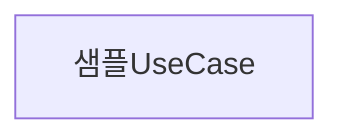

요구사항정의서는 아래 Rule을 참조하여 작성합니다.

### Rule
- 사용자의 요구사항을 분석하여 나열
- 요구사항은 최대한 세세하게 작은 단위로 분할하여 작성합니다.
- 요구사항이 불명확한 내용은 선택지와 장단점을 나열하여 사용자가 선택할 수 있도록 작성합니다.
- 사용자가 문서를 파악하는데 도움이 될 수 있도록 UML을 활용하여 diagram을 작성합니다.
  - diagram은 mermaid uml 문법을 사용합니다.

--- 
아래는 작성 예시입니다.

# {number}-{description}-요구사항정의서

## Summary

- 사용자의 요청을 분석하여 작성한 요구사항정의서의 요약 설명

## 요구사항

- [ ] 구체적인 요구사항1
  - 요구사항에 대한 설명
- [ ] 명확하지 않은 요구사항2
  - 명확하지 않은 점에 대한 설명 
  - 선택지
      1. sample option1
          - 장점
          - 단점
      2. sample option2
          - 장점
          - 단점
  ...

## UML
### UseCase Diagram

### Sequence Diagram
...
