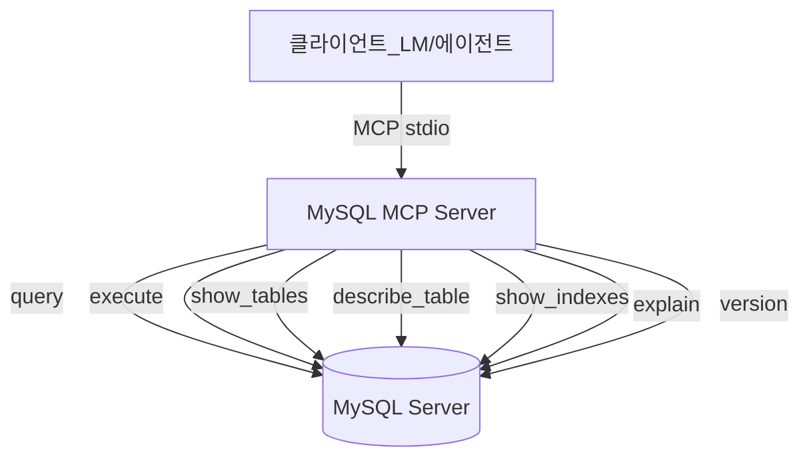
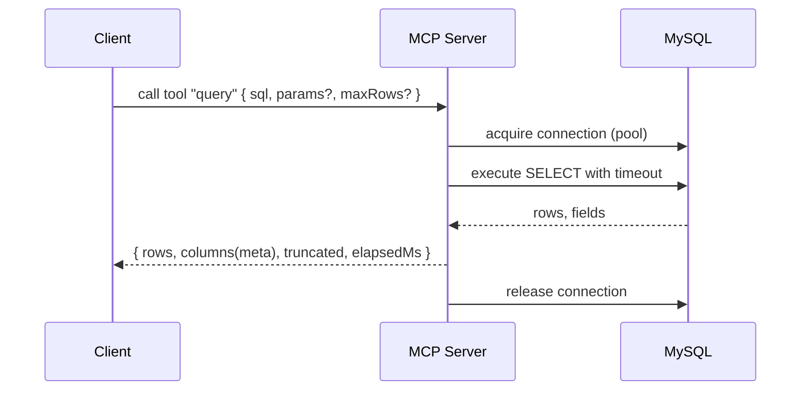

# 0001-mysql-mcp-server-요구사항정의서

## Summary

- MySQL에 접속하여 MCP(Model Context Protocol) 서버로 동작하는 stdio 기반 도구를 제공하고, Docker 이미지로 배포한다.
- 기본 제공 Tool: `query(SELECT 전용)`, `execute(DDL/DML)`, `show_tables(테이블 목록)`, `describe_table(테이블 스키마/주석)`, `show_indexes`, `explain`, `version`.
- 컨테이너 생성 시 환경변수로 접속정보를 입력받아 동작한다.

## 요구사항

- [x] MCP 서버는 stdio 모드로 동작해야 한다.
  - 설명: 표준입출력으로 MCP 프로토콜을 처리하며, 네트워크 포트 노출 없이 호스트 프로세스와 통신한다.
- [x] Docker 이미지로 빌드/배포 가능해야 한다.
  - 설명: `docker build`로 이미지를 생성하고, `docker run` 시 환경변수로 MySQL 접속정보를 주입하여 실행한다.
- [x] Tool: query (SELECT 전용)
  - 설명: 임의의 SELECT 문을 실행하고 결과 행 목록과 메타데이터(컬럼 이름/타입 등)를 반환한다.
  - 제약/옵션:
    - [x] 최대 반환 행 수 제한 (`MAX_ROWS`) 지원, 초과 시 truncate 플래그 반환. (기본 10000)
    - [x] 쿼리 타임아웃(ms) 지원. (기본 60000)
    - [x] 파라미터 바인딩 지원 (예: `sql`, `params: any[]`).
- [x] Tool: execute (DDL/DML)
  - 설명: INSERT/UPDATE/DELETE/CREATE/ALTER/DROP 등 SELECT 외의 문장을 실행하고, `affectedRows`, `insertId`(가능 시), `warningStatus` 등을 반환.
  - 제약/옵션: 쿼리 타임아웃(ms) 지원.
- [x] Tool: show_tables
  - 설명: 현재 데이터베이스의 테이블 목록을 반환. 옵션 `includeViews`로 View 포함 여부 제어(기본 false).
- [x] Tool: describe_table
  - 설명: 특정 테이블의 컬럼 스키마(이름, 타입, 널 여부, 기본값, 키, 추가정보)와 컬럼/테이블 코멘트를 반환.
- [x] Tool: show_indexes
  - 설명: 특정 테이블의 인덱스 목록과 컬럼, 고유성, 가시성, 코멘트 등 정보를 반환.
- [x] Tool: explain
  - 설명: 주어진 SELECT 문에 대해 실행 계획을 반환.
- [x] Tool: version
  - 설명: DB 버전 문자열을 반환.
- [x] 접속정보는 환경변수로 설정한다.
  - 필수: `MYSQL_HOST`, `MYSQL_PORT`, `MYSQL_USER`, `MYSQL_PASSWORD`, `MYSQL_DATABASE`
  - 선택: `MYSQL_SSL`(off|required|verify_ca), `MYSQL_SSL_CA_BASE64`(CA 인증서 base64), `MYSQL_SSL_CERT_BASE64`, `MYSQL_SSL_KEY_BASE64`, `MYSQL_TIMEZONE`, `MYSQL_CHARSET`, `MYSQL_CONNECT_TIMEOUT_MS`, `MYSQL_QUERY_TIMEOUT_MS`, `MYSQL_POOL_MIN`, `MYSQL_POOL_MAX`
- [x] 스키마/DB 선택은 환경변수의 단일 DB 고정만 지원한다. Tool로 DB 전환은 지원하지 않는다.
- [x] 커넥션 풀 지원
  - 설명: 동시 요청 처리 및 성능을 위해 풀을 사용한다. 비활성 시 자동 해제.
- [x] 에러 처리/로깅
  - 설명: SQL 에러, 연결 에러, 타임아웃, 인증 실패 등 코드/메시지 표준화. 민감정보는 로그에 출력하지 않음.
  - 옵션: `LOG_LEVEL`(silent|error|warn|info|debug)
- [x] 호환성
  - 설명: MySQL 5.7/8.0 및 MariaDB 호환(가능 범위 내). 드라이버는 Node.js `mysql2` 사용.
- [x] 보안
  - 설명: 입력 쿼리는 그대로 DB에 전달됨. 서버는 SQL 필터링/권한 관리를 하지 않으며, 자격증명/권한은 DB 계정에 위임.
- [x] 성능/제한
  - 설명: 대용량 결과를 stdio로 전송 시 비용이 큼. 기본 `MAX_ROWS` 제한 값 제공(기본 10,000).
- [x] 종료/복구
  - 설명: SIGINT/SIGTERM 시 풀 및 연결을 정리하고 정상 종료.
- [x] 문서화
  - 설명: 환경변수 목록, 사용 예시(MCP 클라이언트 통합), Docker 사용법을 README에 기술.

## 결정사항 요약
- 결과 포맷: `{ rows, columns, truncated, elapsedMs }` JSON 객체
- show_tables: `includeViews` 옵션(기본 false)
- describe_table: 컬럼 정보 + 테이블 코멘트(인덱스/외래키는 제외)
- 트랜잭션: 1차 범위 제외
- 스키마/DB: 환경변수의 단일 DB 고정만 지원
- SSL: `MYSQL_SSL`, `MYSQL_SSL_CA_BASE64`, `MYSQL_SSL_CERT_BASE64`, `MYSQL_SSL_KEY_BASE64` 지원
- 기본값: `MAX_ROWS=10000`, `MYSQL_QUERY_TIMEOUT_MS=60000`
- 추가 tool: `show_indexes`, `explain`, `version`

## UML
### UseCase Diagram

### Sequence Diagram (query)

