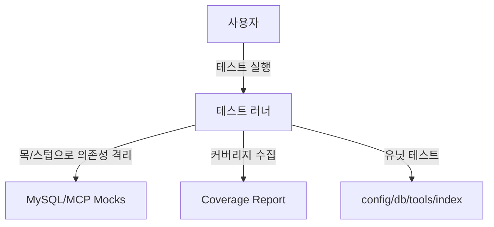
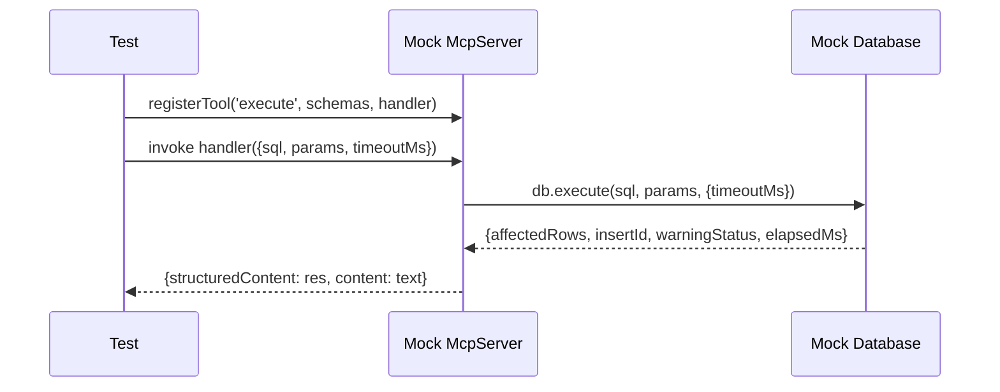

# 0002-test-coverage-요구사항정의서

## Summary

- 본 작업은 현재 프로젝트 코드를 기준으로 테스트 코드를 작성하여 테스트 커버리지 100%를 달성하는 것을 목표로 합니다. 테스트 프레임워크 선정, 목(mock) 전략, 커버리지 설정 및 CI 연동 여부 등 불명확한 항목을 정리하고, 합의된 요구사항에 따라 개발명세서와 테스트 구현을 진행합니다.

## 요구사항

- [ ] 테스트 커버리지 100% 달성(라인, 브랜치, 함수/구문 모든 지표) 
  - 커버리지 임계치(threshold) 100/100/100/100으로 고정
  - 커버리지 대상은 현재 코드뿐 아니라 앞으로 추가될 코드(`src/**/*`)까지 포함하도록 설정
- [ ] 테스트 프레임워크: Vitest 채택 (ESM + TS 친화)
- [ ] TypeScript 지원 테스트 실행 환경 구성
  - 소스: `src/**/*.ts` 대상, ESM 모듈, TS 컴파일 옵션 준수
- [ ] 목/스텁 전략 수립
  - MySQL 드라이버 `mysql2/promise`의 풀/쿼리 호출 목 처리
  - MCP SDK `@modelcontextprotocol/sdk` 서버 인스턴스의 `registerTool` 목 처리
- [ ] 시간/타임아웃 관련 동작의 결정론적 테스트
  - `Database.withTimeout` 로직 검증 (타임아웃/성공 경로)
- [ ] 각 모듈 단위 테스트 항목 정의 및 구현
  - `src/config.ts`: `ConfigSchema`, `loadConfig`의 다양한 환경변수 조합/에러 케이스, SSL 모드(`off`, `required`, `verify_ca`) 및 base64 처리
  - `src/db.ts`: `queryRows`, `execute`, `showTables`, `describeTable`, `showIndexes`, `explain`, `version` 로직
    - `fields`가 undefined인 경우, `maxRows`에 따른 `truncated` 처리, elapsed 시간 계산
    - 인덱스 집계(Map) 로직, `visible`/`unique` 변환, `describeTable`의 병렬 쿼리 결과 합성
  - `src/tools/*.ts`: 모든 툴(`query.ts`, `execute.ts`, `show_tables.ts`, `show_indexes.ts`, `describe_table.ts`, `explain.ts`, `version.ts`)의 등록/입출력 스키마 검증 및 핸들러 동작
  - `src/index.ts`: 서버 초기화, 툴 등록 호출, 종료 시그널 처리(간접 검증; 실제 프로세스 종료는 테스트에서 모의)
- [ ] 테스트 실행 스크립트 및 커버리지 리포트 생성
  - `npm test`로 실행, `coverage/` 폴더 산출
- [ ] 통합 시나리오 테스트(선택 실행)
  - 로컬 DB(mysql://localhost:3306/user=sample&password=sample123!@#)에 대해 읽기 전용 쿼리로 전체 흐름 점검 (실패 시 테스트 자동 건너뜀)
- [ ] CI 구성은 범위 제외

### 명확하지 않은 요구사항 및 선택지

- 현재 단계에서 추가 선택지는 없습니다. 상기 범위로 진행합니다.
- E2E 테스트는 로컬 DB 가용성에 따라 자동 스킵되며, 커버리지는 단위 테스트만으로 100% 만족하도록 구성합니다.

## UML
### UseCase Diagram

### Sequence Diagram (예: execute tool 호출)

